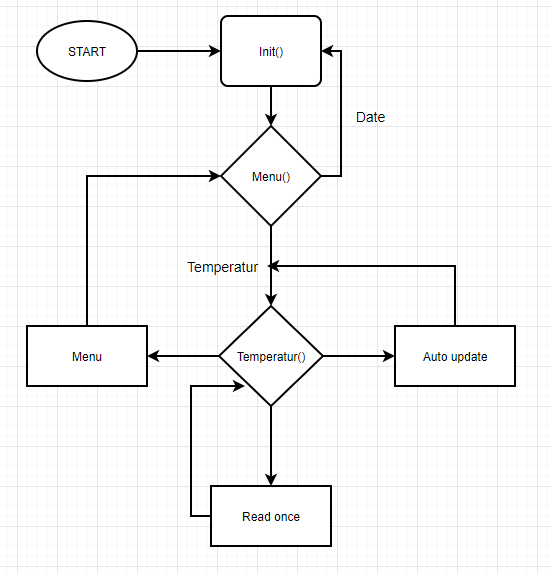

# Det intelligente hus H5

## Indledning

Projektet jeg har lavet er ret simpelt, da jeg havde en del problemer med den forrige kode.
Det valgte projekt er en udvigelse af mit gamle projekt, fra H3. Forskellen mellem dette projekt og det forrige,
er at temperaturen bliver målt med et andet komponent, nemlig en DHT11, men ikke nok med det, så bliver både temperaturen
og fugtigheden målt, og smid op på thingspeak, med en ESP8266.

## Problemer

- Et af de udfordringer jeg har haft med projektet var at den forrige kode var alt for udspredt, hvad jeg mener med dette er at hvert enkelt methode havde en fil for sig selv.
- ESP8266 reagered ikke altid, og det var svært at finde problemet.
- Mange af problemmerne lå på ledningerne, da boardet er godt fyldt op.

## Flowchart



## Pinout

### EPS8266

| PIN | PORT |
|:---:|:----:|
| VCC | 3.3V   |
| RST | 3.3V   |
| CH_PD | 3.3V |
| GND | GND |
| TxD | Rx1 & Tx0 |
| RxD | Mellem 2K modstand som går til ground og 1K som går til Tx1 |

### DHT11

| PIN | PORT |
|:---:|:----:|
| signal | PB3 |
| VCC | 5V |
| GND | GND |

### LCD displayet

| PIN | PORT |
|:---:|:----:|
| VSS | GND |
| VCC | 5V |
| VO | GND & 5V, med en potentiometer imellem |
| RS | E4 |
| RW | E5 |
| E | G5 |
| Data 4 | E3 |
| Data 5 | H3 |
| Data 6 | H4 |
| Data 7 | H5 |
| A | 5V |
| K | GND |

## Dele af koden

### Menu

Dette er koden til menuen. Menuen vises på LCD displayet, og brugeren har mulighed for at vælge enten at læse temperaturen eller "dato",
dato delen virker dog ikke, da jeg ikke har nået at implementere det.

- **Menu(void)** kører de to andre methoder igennem og gør det muligt for brugeren at trykke på enten "A" eller "B", for at komme videre.
- **Menu_choices(void)** bliver kørt en gang og viser menuen på LCD displayet, så brugeren ved hvad der kan vælges.
- **Menu_decoder(int column, int row)** tager imod et *column* tal og et *row* tal, det vil sige at den kan finde ud af hvilken knap brugeren har trykket på.

``` C
void Menu(void)
{
	_delay_ms(1000);
	unsigned int column = 1;
	unsigned int row = 90;
	
	Menu_choices();
	
	while (1)						/* While løkke som kører indtil brugeren har entent trykket på "A" eller "B" knappen */
	{
		column = ColumnScan(column);
		row = ReadRow();
		
		Menu_decoder(column, row);
		
		_delay_ms(25);
	}
	
}
``` 

``` C
void Menu_choices(void)				/* Viser menuen på LCD displayet */
{
	Pre_display();
	
	lcd_puts("Date");
	lcd_gotoxy(10,0);
	lcd_puts(": A\n");
	lcd_puts("Temperatur: B");
	lcd_gotoxy(15, 1);
}
```

``` C
void Menu_decoder(int column, int row)			/* Decoder, til valg i menuen. Dette er brugt fra det tidligere projekt, hvor det var meningen at man skulle måle afstand, */
{												 /* det kom dsv. ikke til at ske, og i dette projekt, ligesom det tidligere, bliver det kun brugt til temperatur */
	unsigned int chosen = column + row;
	
	switch (chosen)
	{
		case 44:
		main();								/* Hvis "A" knappen er valgt bliver brugeren smidt tilbage til menuen */
		break;
		
		case 34:
		Temperatur();						  /* Hvis "B" knappen er valgt bliver brugeren smidt til temperatur menuen */
		break;
		
		default:
		
		break;
	}
}
```
### Temperatur

#### Temperatur Menu

Temperatur menuen virker lidt på samme måde. Der bliver vist hvad brugeren kan trykke på og hvad det gør.

- **Temperatur(void)** kører de nødvendige methoder igennem, men i modsætning til **Menu()**, så har brugeren mulighed for at gå tilbage til menuen.
- **Temperatur_choices(void)** gør det muligt for at vise til brugeren hvad der kan trykkes på og hvad der vil ske. I dette tilfælde er der mulighed for at enten hente temperaturen automatisk, eller kun en gang. Dog virker den automatiske opdatering ikke.
- **Temperatur_decoder(int column, int row)** gør det samme som i menuen. Tager imod et *column* tal og et *row* tal, hvor den derefter kan se hvad brugeren har trykket på, og smider brugeren det rigtig sted hen.

``` C
void Temperatur(void)
{
	_delay_ms(1000);
	
	unsigned int column = 1;
	unsigned int row = 90;
	
	Temperatur_choices();
	
	while (1)
	{
		
		column = ColumnScan(column);
		row = ReadRow();
		
		Temperatur_decoder(column, row);
		
		if (column + row == 11)
		{
			main();
		}
		
		_delay_ms(25);
	}
	
}
```

``` C
void Temperatur_choices(void)
{
	Pre_display();

	lcd_puts("Auto update:");
	lcd_gotoxy(13,0);
	lcd_puts("1");
	
	lcd_gotoxy(0,1);
	
	lcd_puts("Read Once:");
	lcd_gotoxy(13, 1);
	lcd_puts("2");
	
	lcd_gotoxy(15, 1);
}
```

``` C
void Temperatur_decoder(int column, int row)
{
	unsigned int choose = column + row;
	
	switch (choose)
	{
		case 41:
		Temperatur_ReadOnce(1);
		break;
		
		case 42:
		Temperatur_ReadOnce(0);
		break;
		
		default:
		/* Your code here */
		break;
	}
}
```

#### Temperatur beregning

I dette projekt kan temperaturen og fugtigheden læses, men udover det kan det data også blive smidt ud på en API.

- **Temperatur_ReadOnce(int loop)** er den del som læser temperaturen og fugtigheden *en* gang, det var meningen at den kunne tage imod en *int*, så den kunne vide om methoden skulle køre flere gange,
men som nævt tidligere, blev dette ikke gjort færdig. Det den gør er at den kører nogle methoder igennem for at hente selve temperaturen og fugtigheden fra **DHT11**'eren.
- **PushToAPI(int temperatur, int humidity)**, denne methode er nok en af de mere komplicerede. Med hjælp fra en **ESP8266**, kan temperaturen og fugtigheden blive sendt ud til en API.
- **Temperatur_display(int temperatur, int humidity)** tager imod temperatur og fugtighed, derefter bliver det vist på LCD displayet.

``` C
void Temperatur_ReadOnce(int loop)
{
	unsigned int column = 1;
	unsigned int row = 90;
	
	
	DHT_WakeUp();										/* Sender et signal ud til DHT11'eren for at se om der er forbindelse */
	int array[5][8];
	if (DHT_Response())									/* Hvis der er forbindelse til en DHT11'ere, så bliver koden i IF'en kørt */
	{
		DHT_Decode_Data(array);							/* Henter dataen fra DHT11'eren og gemmer den i et MULTIDIMENSIONELT array */
		
		int temp = ConvertToDecimal(array, 3);			/* Temperaturen og fugtigheden bliver gemt i en variabel, */
		int hum = ConvertToDecimal(array, 1);			/* men inden skal den lige konventeres til decimal */
		
		Temperatur_display(temp, hum);					/* Displayer temperaturen og fugtigheden på LCD displayet */
		
		PushToAPI(temp, hum);							/* Smider data ud mod Thingspeaks api, så det kan vises på en graf */
		while(1)
		{
			column = ColumnScan(column);
			row = ReadRow();
			
			if (column + row == 11)
			{
				main();
			}
			
		}
	}
}
```

``` C
void PushToAPI(int temperatur, int humidity)
{
	char _buffer[150];
	uint8_t Connect_Status;
	while(!ESP8266_Begin());
	ESP8266_WIFIMode(BOTH_STATION_AND_ACCESPOINT);						/* 3 = Both (AP and STA) */
	ESP8266_ConnectionMode(SINGLE);										/* 0 = Single; 1 = Multi */
	ESP8266_ApplicationMode(NORMAL);									/* 0 = Normal Mode; 1 = Transperant Mode */
	while(ESP8266_connected() == ESP8266_NOT_CONNECTED_TO_AP)			// Mens ESP8266 ikke er tilsluttet til nettet, prøver den at oprette en forbindelse
	{
		ESP8266_JoinAccessPoint(SSID, PASSWORD);
	}
	ESP8266_Start(0, DOMAIN, PORT);										// Connect to API

	memset(_buffer, 0, 150);
	// Sender det nødvendige data, temperatur og fugtighed, til Thingspeaks API
	sprintf(_buffer, "GET /update?api_key=%s&field7=%i&field8=%i", API_WRITE_KEY, temperatur, humidity);
	ESP8266_Send(_buffer);
	_delay_ms(15000);													/* Thingspeak server delay */	
}
```

``` C
void Temperatur_display(int temperatur, int humidity)
{
	char buffer[8];
	Pre_display();
	
	sprintf(buffer, "Temp: %d", temperatur);

	lcd_puts(buffer);
	lcd_gotoxy(0,1);
	
	sprintf(buffer, "Hum : %d", humidity);
	lcd_puts(buffer);
}
```